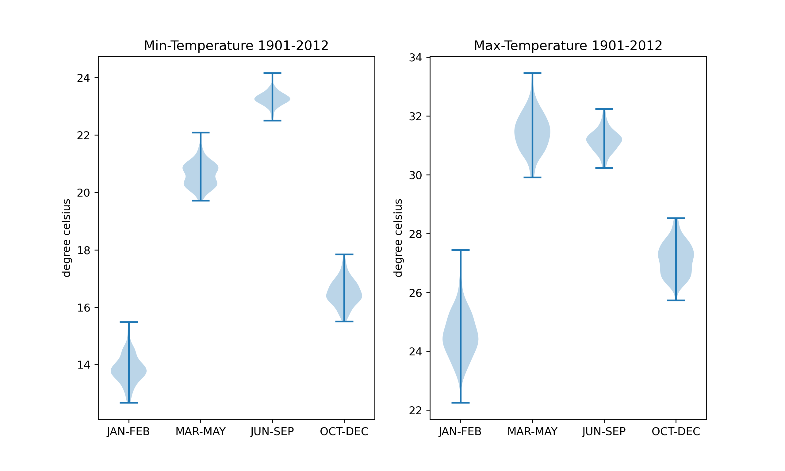
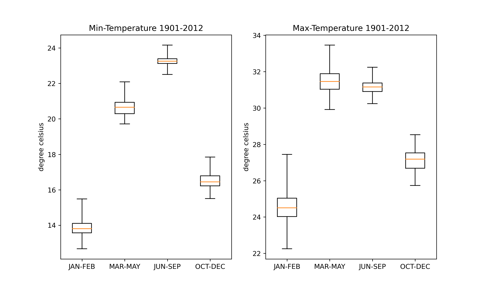
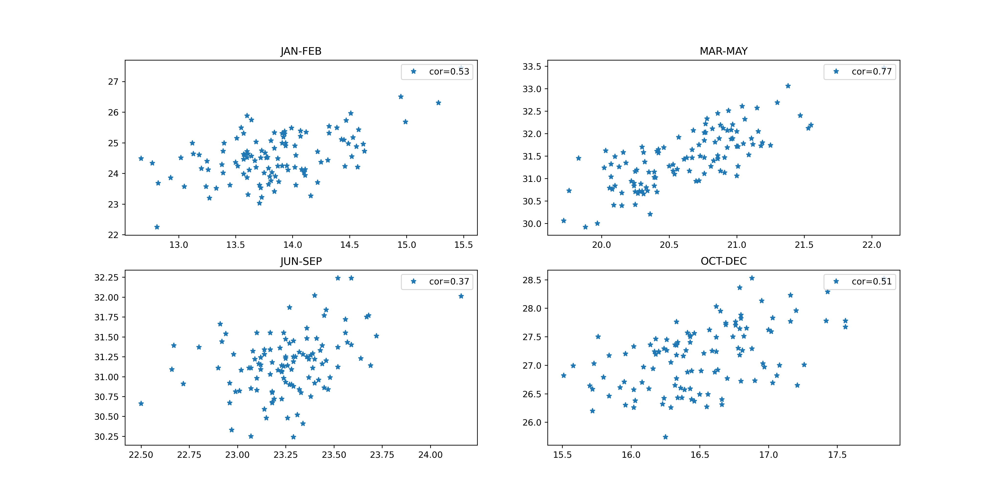
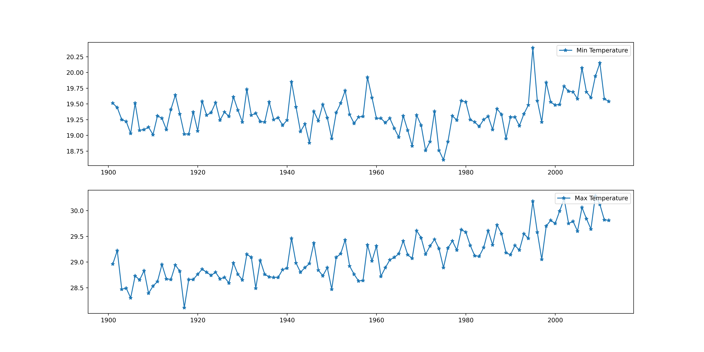

# Min-Max India's Temperature Data Visualization (1901-2012)

The [minimum temperature dataset](https://data.gov.in/resource/annual-and-seasonal-minimum-temperature-india "webpage showing details")
and [maximum temperature dataset](https://data.gov.in/resource/annual-and-seasonal-maximum-temperature-india "webpage showing details") were
used from [govt. open data website](https://data.gov.in/ "govt data website homepage")

## Violin Plot
It shows the distribution of the temperature data for 112 years.

1. Notice the higher variance in maximum temperatures compared to minimum temperatures.
2. Highest variance can be observed in the Jan-Feb for both max and min temperatures

## Box Plot

Box plot showing the first, median, third quartile along with min, max.
Observation similar to violin plot can be made here

## Scatter Plot

The plot is between min-max temperature in the months of the year. We observe that
the correlation of min-max temperature which is highest in the Mar-May with value of 0.77.
Thus we can conclude that years in which minimum temperature are elevated, the maxumum temperatures are also
elevated. Month of Jun to September had least correlation, thus we can say these months observe the most stable
temperatures.

## Line Plot

With this plot, we can observe the steady rise in maximum temperature with time. The rise has become significant after
1960's which apparently marks rise of population, manufacturing, automobiles etc with declination of green cover.

